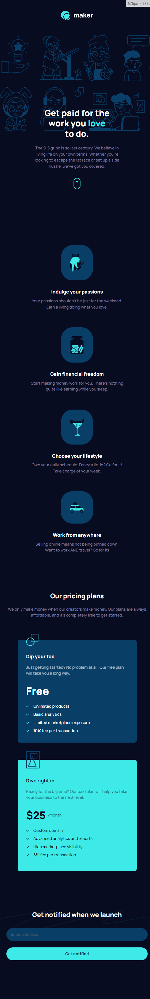

# Frontend Mentor - Maker pre-launch landing page solution

This is a solution to the [Maker pre-launch landing page challenge on Frontend Mentor](https://www.frontendmentor.io/challenges/maker-prelaunch-landing-page-WVZIJtKLd). Frontend Mentor challenges help you improve your coding skills by building realistic projects.

## Table of contents

- [Overview](#overview)
  - [The challenge](#the-challenge)
  - [Screenshot](#screenshot)
  - [Links](#links)
- [My process](#my-process)
  - [Built with](#built-with)
  - [What I learned](#what-i-learned)
- [Author](#author)
- [Contribution](#contribution)

## Overview

### The challenge

Users should be able to:

- View the optimal layout depending on their device's screen size
- See hover states for interactive elements
- Receive an error message when the form is submitted if:
  - The `Email address` field is empty should show "Oops! Please add your email"
  - The email is not formatted correctly should show "Oops! That doesn’t look like an email address"

### Screenshot

- Mobile (390px)


- Tablet (768px)



- Desktop (1440px)


### Links

- [Solution URL](https://www.frontendmentor.io/solutions/maker-pre-launch-landing-page-react-typescript-postcss-aOH7-P7Vn6)
- [Live Site URL](https://maker-pre-launch-landing-page-acdev.vercel.app/)

## My process

### Built with

- Semantic HTML5 markup
- CSS custom properties
- Flexbox / Grid
- Mobile-first workflow
- [Typescript](https://www.typescriptlang.org/)
- [React](https://react.dev/)
- [PostCSS](https://postcss.org/)

### What I learned

#### Multiple background images

The Hero section of the layout was a challenge because of the placement of the multiple background images.

```css
@media (min-width: 768px) {
  margin-top: var(--space-lg);
  --img-offset: 25rem;
  --squiggle-size: 78%;
  --squiggle-position: center;
  padding: var(--space-2xl) 0;
  background: url('/assets/bg-hero-squiggle.svg') var(--squiggle-position) / auto var(--squiggle-size) no-repeat, url('/assets/illustration-hero-left.svg')
      calc(50% - var(--img-offset)) / contain no-repeat,
    url('/assets/illustration-hero-right.svg') calc(50% + var(--img-offset)) / contain no-repeat;
}
```

## Author

- Frontend Mentor - [@AntoineC-dev](https://www.frontendmentor.io/profile/AntoineC-dev)

## Contribution

You can use this project for whatever you want. Don't forget to leave a ⭐.

- Fork the project to add it to your githug repositories.
- Clone it on your local machine from you repositories.
- Install all the dependencies by running `npm install` or `yarn` or `pnpm` from a terminal located in the project.
- Open the project in your editor and start coding.
